# E-commerce System Class Diagram

## Overview
This class diagram represents the complete structure of the e-commerce system, including models, controllers, and their relationships.

## Models (Data Layer)

### User Model
```mermaid
classDiagram
    class User {
        +String userID (unique, sparse)
        +String name (required)
        +String phoneNum (default: '')
        +String email (required, unique)
        +String password (required)
        +String profilePicture (default: '')
        +String address (default: '')
        +CartItem[] cartData (default: [])
    }
    
    class CartItem {
        +String productId
        +String name
        +Number price
        +String[] image
        +String selectedSize
        +Number selectedQuantity
        +Number quantity
    }
    
    User ||--o{ CartItem : contains
```

### Admin Model
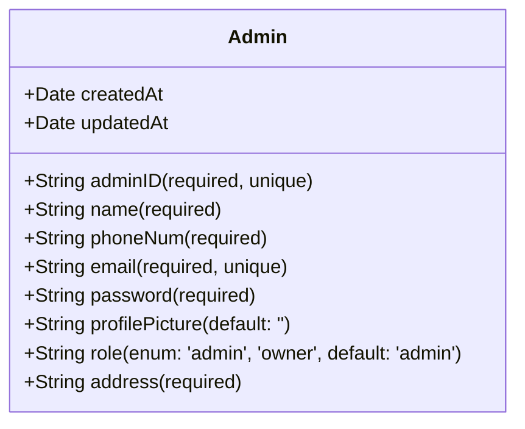

### Product Model
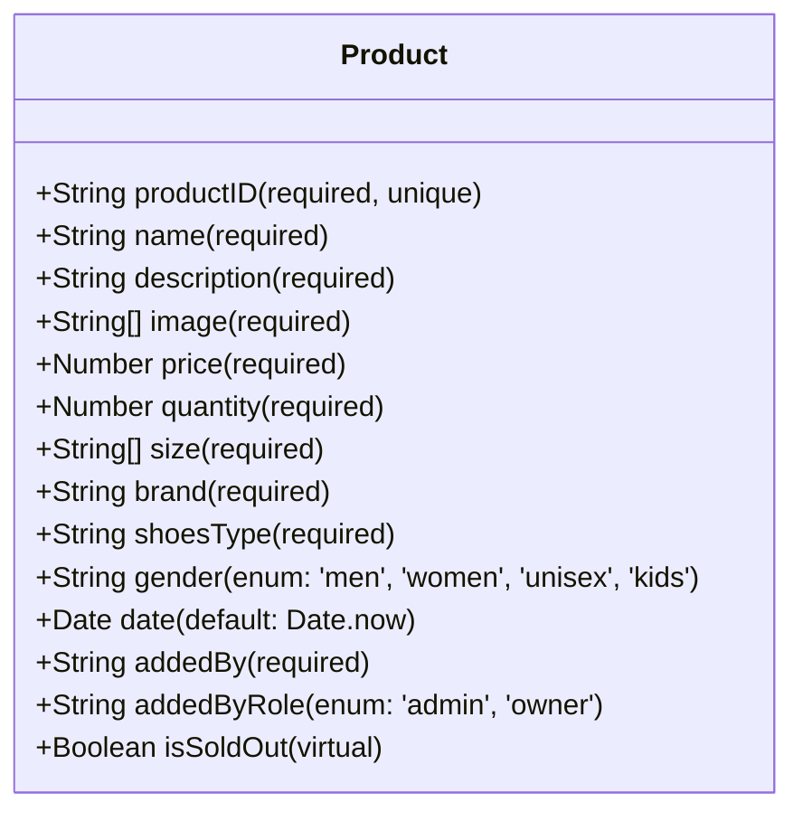

### Order Model
```mermaid
classDiagram
    class Order {
        +String orderID (required, unique)
        +String userID (required)
        +String name (required)
        +String email (required)
        +String phoneNum (required)
        +String address (required)
        +OrderProduct[] products (required)
        +Number totalPrice (required)
        +Date date (default: Date.now)
        +String status (enum: 'pending', 'paid', 'delivered', 'cancelled')
        +String payment (required)
    }
    
    class OrderProduct {
        +String productID (required)
        +String[] image (required)
        +String name (required)
        +Number price (required)
        +Number quantity (required)
        +Number subprice (required)
    }
    
    Order ||--o{ OrderProduct : contains
```

### ResetPin Model
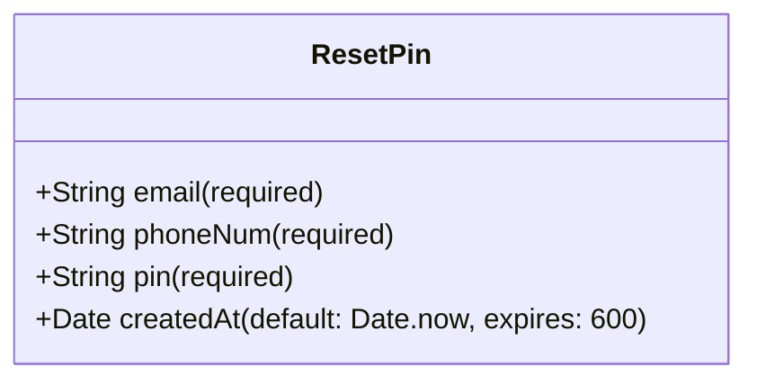

## Controllers (Business Logic Layer)

### UserController
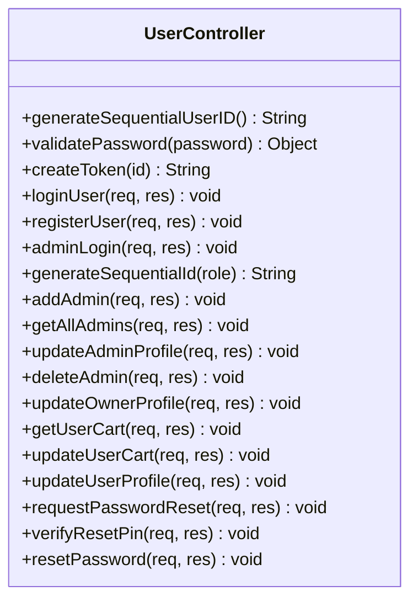

### ProductController
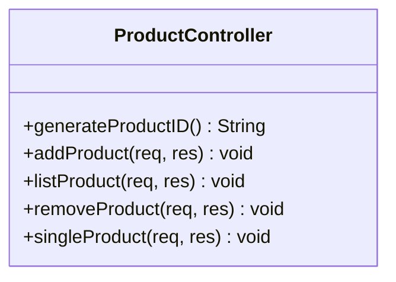

### OrderController
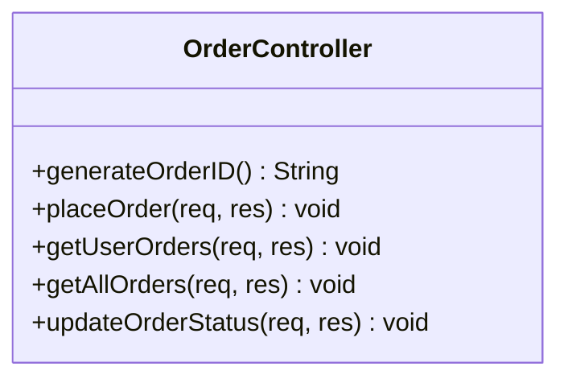

## Relationships

### Entity Relationships
```mermaid
classDiagram
    User ||--o{ Order : places
    User ||--o{ CartItem : has
    Admin ||--o{ Product : adds
    Product ||--o{ OrderProduct : referenced_in
    Order ||--o{ OrderProduct : contains
    User ||--o{ ResetPin : requests
```

### Controller Dependencies
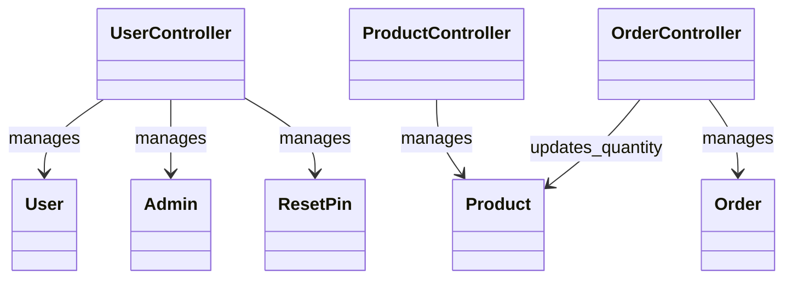

## Frontend Components

### Pages
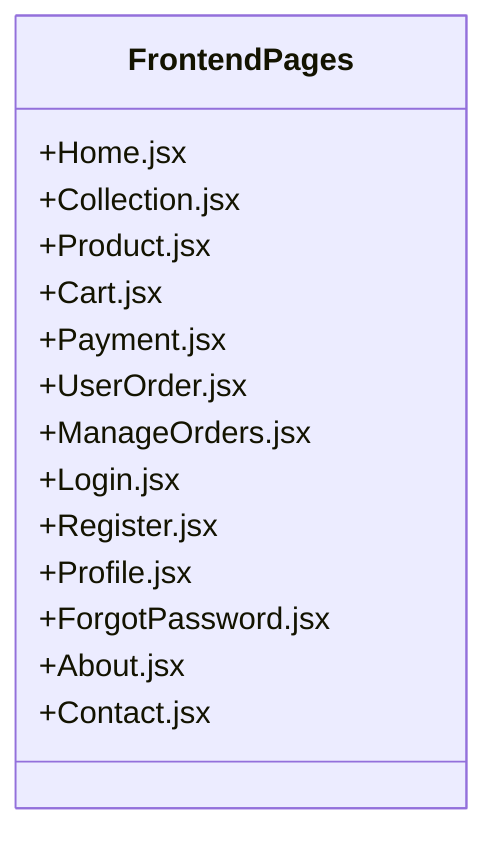

### Services
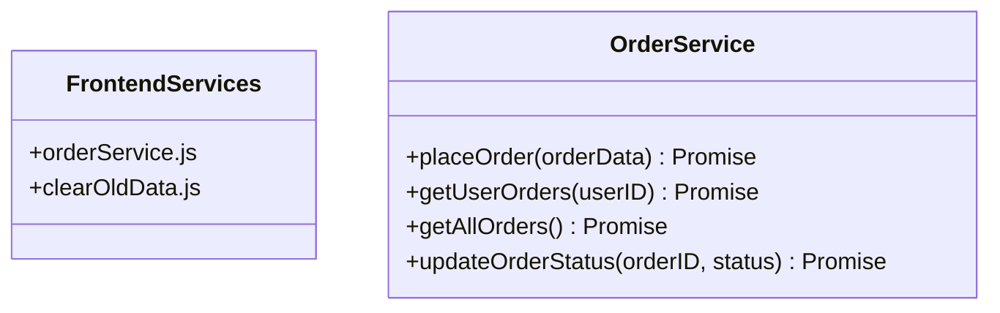

## Middleware

### Authentication Middleware
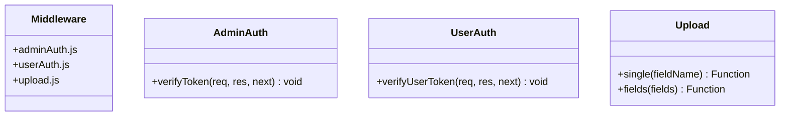

## Routes

### API Routes
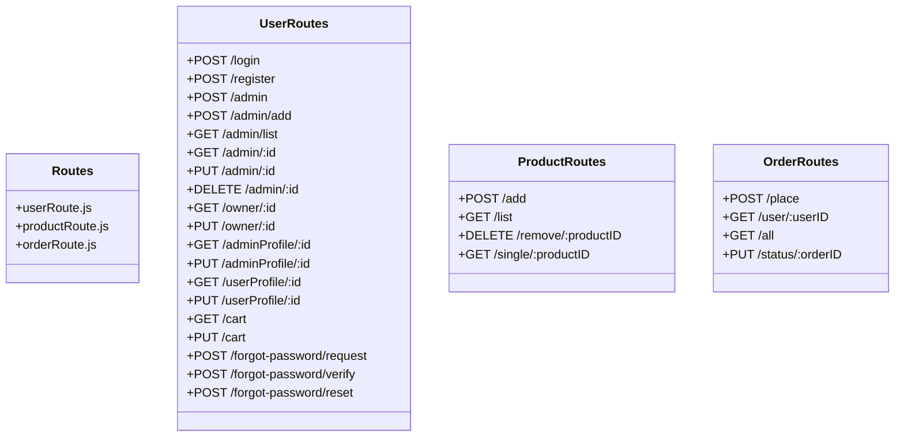

## Complete System Architecture

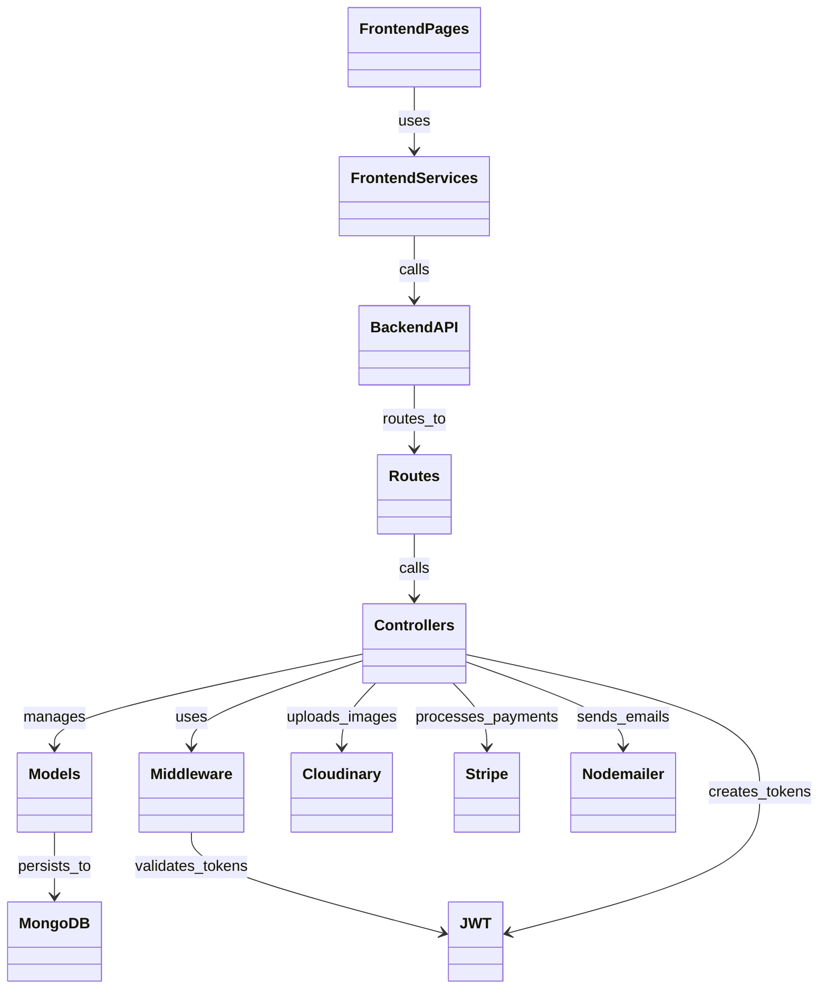

## Key Features

### Authentication & Authorization
- JWT-based authentication
- Role-based access control (User, Admin, Owner)
- Password reset via email

### E-commerce Features
- Product catalog with filtering
- Shopping cart management
- Order placement and tracking
- Payment processing (Stripe integration)
- Inventory management

### Admin Features
- Product management (CRUD)
- Order management and status updates
- User management
- Admin profile management

### User Features
- User registration and login
- Profile management
- Order history and tracking
- Shopping cart persistence

## Database Schema Summary

| Collection | Purpose | Key Fields |
|------------|---------|------------|
| users | User accounts | userID, email, password |
| admins | Admin accounts | adminID, email, role |
| products | Product catalog | productID, name, price, quantity |
| orders | Order records | orderID, userID, products, status |
| resetPins | Password reset | email, pin, createdAt |

This class diagram provides a comprehensive view of the e-commerce system's architecture, showing how all components interact to provide a complete online shopping experience. 